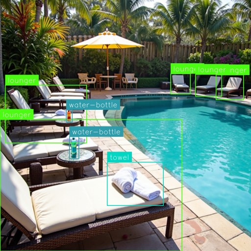
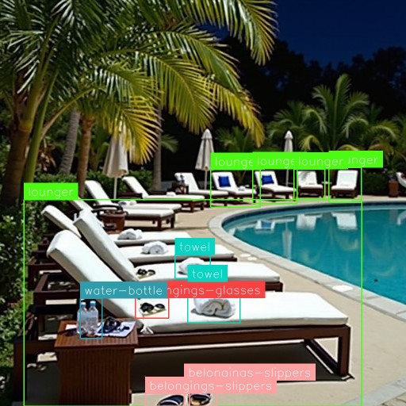

# Resort Pool Management Service

## Background

In resort settings, a common issue arises where guests reserve pool chairs early in the morning, leaving others unable to use them for the rest of the day. To address this, we propose an optimization solution for our iconic pool area, ensuring equitable access to poolside amenities for all guests.

## Objective

Create an AI-driven solution for real-time monitoring of pool lounger usage. This service will empower resort staff to swiftly determine chair occupancy status, ensuring guest satisfaction and efficient resource allocation.

## Concept Abstract

As part of the standard poolside concierge service, a pool attendant assists guests by placing a fresh towel on each lounge chair. Therefore, a sun lounger that is covered with a towel can be considered "in service" and occupied by a guest.  
When a guest has finished using the lounger, the resort staff needs to be notified in a timely manner. At that point, the staff can clean up any towels, water bottles, or other items left behind by the departing guest.  

To determine when a lounger is ready for cleanup, the system can analyze poolside CCTV footage captured by cameras in real-time. If the footage shows loungers with towels and water bottles present, but no people or personal belongings are visible, the system can flag those loungers as "awaiting cleanup."
If the "awaiting cleanup" status persists, the system should notify resort staff. This will ensure timely cleanup of vacated loungers and keep the poolside area tidy and ready for the next guests.

^ No personal belongings present, therefore guests may has left. Used towel and drinks are left behind. This should be categorized as a **awaiting cleanup** status.

^ Guests may still be present, as glasses and slippers are visible. Therefore, this should be categorized as a **normal** status.

#### Video footage

<video width="960" height="540" controls>
<source src="https://storage.googleapis.com/bucket-trial-run/video-inference-2.mp4" type="video/mp4">
</video>

^ There is a crowded area with guests and some personal belongings present. Several lounger seats are available for use. There are few towels and water bottles visible.
Given these observations, the status should be categorized as **normal**.

## Object Recognition

### Annotation

Setting of 12 classes:  
belongings-cloth, belongings-glasses, belongings-slippers, belongings-swimming-ring, belongings-wristlet  
lifeguard-chair, lounger, lounger-serving, lounger-water-drop  
person, towel, water-bottle

## Version 1

Total: 67 images  
Training Set: 47 images  
Validation Set: 13 images  
Testing Set: 7 images  

## Processing

Resize 640x640  
YOLO-NAS S Object Detection (Accurate)  
Pre-train benchmark model: MS COCO v14-Best (Common Objects, 52.2% mAP)  
16 minutes in training  

## Generative Image

Improvment

### SDXL Refiner

like img2img

### Prompt

FLUX with 1 promopt 

CCTV footage from poolside cameras on a summer rainy noon. Comfortable lounge chairs set next to the pool. Some lounger are neatly covered with fresh white towels, ready for guests, some personal belongings are placed on a small table next to the lounger, such as water bottles, sunglasses, also a pair of slippers are left on the floor. Lush palm trees and other tropical foliage frame the scene in the background. The pool water is crystal clear and inviting.

## Inference Workflow

<video width="960" height="540" controls>
    <source src="https://storage.googleapis.com/bucket-trial-run/image-inference.mp4" type="video/mp4">
</video>

The simplified inference pipeline allows various components to be customized and run in parallel, including object detection, bounding box generation, labeling, and image cropping. This setup enables real-time visualization of inference results.
