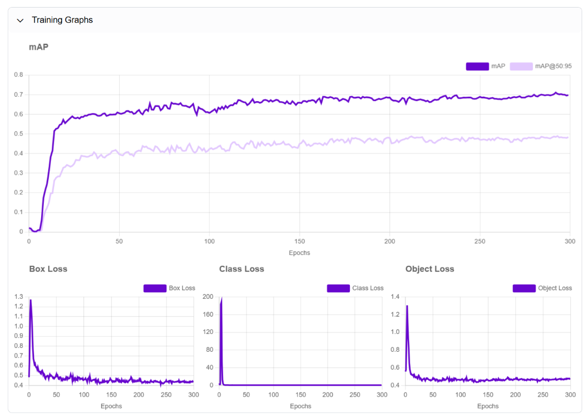

# Resort Pool Management Service

## Introduction

In resort settings, a common issue arises where guests reserve pool chairs early in the morning, leaving others unable to use them for the rest of the day. To address this, we propose an optimization solution for the iconic pool area, ensuring equitable access to poolside amenities for all guests.

## System Overview

Our solution focuses on real-time monitoring of pool lounger usage, empowering resort staff to swiftly determine chair occupancy status, thereby enhancing guest satisfaction and resource allocation.  
As part of the standard poolside concierge service, a pool attendant assists guests by placing a fresh towel on each lounge chair. Therefore, a sun lounger that is covered with a towel can be considered "in service" and occupied by a guest.  
When a guest has finished using the lounger, the resort staff needs to be notified in a timely manner. At that point, the staff can clean up any towels, water bottles, or other items left behind by the departing guest.  

To determine when a lounger is ready for cleanup, the system can analyze poolside CCTV footage captured by cameras in real-time. If the footage shows loungers with towels and water bottles present, but no people or personal belongings are visible, the system can flag those loungers as "awaiting cleanup."
If the "awaiting cleanup" status persists, the system should notify resort staff. This will ensure timely cleanup of vacated loungers and keep the poolside area tidy and ready for the next guests.

^ No personal belongings present, therefore guests may has left. Used towel and drinks are left behind. This should be categorized as a **awaiting cleanup** status.

^ Guests may still be present, as glasses and slippers are visible. Therefore, this should be categorized as a **normal** status.

## Work 1. Object Detection

The object detection solution is built using Roboflow's cloud-based platform, allowing for efficient focus on innovation rather than infrastructure management. We have established 12 classes for detecting essential objects, including:
Person
Towel
Water bottle
Lifeguard chair
Lounger
Lounger serving
Lounger water drop
Belongings (cloth, glasses, slippers, swimming ring, wristlet)

### 1.1 Data Sources

#### From real life photos

#### From AI generative images

### 1.2 Model Output

After resizing images to 640x640 and augmenting them through flipping and rotating, the dataset increased to a total of 298 images, ready for training. We selected the YOLO-NAS S model with a pre-trained benchmark model (MS COCO v14-Best), achieving a mean Average Precision (mAP) of 71.1% after training, with no signs of overfitting.

## Work 2. Scalable Inference

Now that the model is ready, video inference is crucial for scaling object detection. It enables the integration of temporal information, improves processing efficiency, enhances accuracy, and supports real-time applications. This approach ensures that the system is robust enough to operate effectively in various pool areas and different environments, as well as in other similar applications.

### 2.1 Inference Workflow

A simplified inference pipeline allows various components to be customized and run in parallel,  
including object detection, bounding box generation, labeling, and image cropping.  
This setup enables real-time visualization of inference results.

<video width="960" height="540" controls>
    <source src="https://storage.googleapis.com/bucket-trial-run/image-inference.mp4" type="video/mp4">
</video>

### 2.2 Inferencing Video Footage (Proof of Concept)

Package potentially use: inference, supervision, cv2  
Video inferencing sample code can be found here:
[sample-inference-roboflow.ipynb](https://github.com/adamzerg/resort-pool-management/blob/main/inference-roboflow.ipynb)

<video width="960" height="540" controls>
<source src="https://storage.googleapis.com/bucket-trial-run/video-inference-2.mp4" type="video/mp4">
</video>

^ There is a crowded area with guests and some personal belongings present.  
Several lounger seats are available for use. There are few towels and water bottles visible.  
Given these observations, the status should be categorized as **normal**.

## Work 3. Generative AI For Data Augmentation

Generative AI models are employed to synthetically create diverse training images for object detection models. These generated images cover a wide range of scenarios, such as varying times of day, occupancy levels, and guest profiles. This approach helps to robustly train the object detection model without compromising privacy, as the generated images are not based on real-world data that could potentially reveal sensitive information.  

By augmenting the training dataset with these synthetically generated images, the object detection model is exposed to a more comprehensive set of scenarios. This increased diversity in the training data leads to improved model performance and generalization, as the model learns to recognize objects in a broader range of conditions.  
The use of generative AI for data augmentation helps to increase the mAP (mean Average Precision) of the object detection model. By training the model on a larger and more diverse dataset, including synthetically generated images, the model becomes better equipped to accurately detect objects in various situations, resulting in a higher mAP score.

### 3.1 Comfy configurations for Flux.1

Model: flux1-dev-fp8.safetensors  
Clip: t5xxl_fp16.safetensors, clip_l.safetensors  
VAE: ae.safetensors  
KSampler: euler  
Sample rompt: CCTV footage from poolside cameras on a summer rainy noon. Comfortable lounge chairs set next to the pool. Some lounger are neatly covered with fresh white towels, ready for guests, some personal belongings are placed on a small table next to the lounger, such as water bottles, sunglasses, also a pair of slippers are left on the floor. Lush palm trees and other tropical foliage frame the scene in the background. The pool water is crystal clear and inviting.

Sample json can be found here:
[flux1-workflow](https://raw.githubusercontent.com/adamzerg/resort-pool-management/main/flux1-workflow.json)

### 3.2 Alternative SD3 and SDXL

Initially, attempts to run SD3 and SDXL with the refiner (img2img) yielded good results.  
However, Flux.1 excels in generating high-quality images with superior detail and offers greater output diversity, producing a wider range of creative interpretations from the same prompt compared to SD3 and SDXL.

The ELO score performance (evaluation ranking) of the Flux.1[dev] (used in our case) compared to others

## Work 4. Deployment Strategies For Real-time Application

As part of the service, we must ensure that we provide messages to our pool attendant regarding cleanup actions.
Moving forward, we have two primary deployment strategies to consider: the use of a centralized console system or a client-edge deployment with surveillance cameras, allowing for individual communication with the messaging API.  

Serverless, over-the-air (OTA) to push upgrades. Object detection and rule processing are running on the edge (individual surveillance cameras).  
Lightweight deployment, higher requirements for individual equipment's edge computing power.  

Centralized with a single server backend, it collects video footage from each surveillance camera and processes object detection and messages in batches.  
This setup is effective for managing rule changes and is highly customizable for message production per mobile user (such as pool attendants), but it is heavily dependent on video streaming networks.  

With this structure, it is also possible to further develop large language models (LLMs) that can proactively adjust message rules based on information collected from sources beyond just camera footage.    

## Conclusion

In summary, we have developed a prototype utilizing an object detection model, demonstrated its scalability through video inference, and explored enhancements with generative AI. As we continue to refine our solution, we aim to ensure equitable access to poolside amenities while maintaining a clean and enjoyable environment for all guests. 

## Further Enhancements

The mentioned deployment strategies can be chosen depending on the actual available environment. Several improvements can be made to enhance the model's performance.  
First, for enhancing data diversity, while the current dataset includes real and synthetically generated images, increasing the variety of scenarios—such as more real-life photos of our specific resort pools under different weather conditions and with varying guest behaviors—could significantly improve the model's robustness and accuracy.  
Second, fine-tuning hyperparameters through continuous experimentation during training could optimize the model's performance, potentially increasing the mean Average Precision (mAP) score beyond the current 71.1%. Additionally, integrating data from other sensors, such as temperature and humidity, could provide more context for the model, thereby improving its decision-making capabilities regarding lounger status and guest comfort.  
Implementing a real-time feedback loop where pool attendants can provide input on the model's predictions would help refine its accuracy over time, allowing it to learn from real-world usage. Expanding the object classes for detection by adding more categories, such as different types of personal belongings or pool equipment, could enhance the model's utility and provide more detailed insights into poolside usage.  
Moreover, improving edge computing capabilities is essential, as the deployment relies heavily on edge computing power; optimizing the model for lightweight deployment could enhance processing speed and reduce dependency on video streaming networks. Finally, developing a more intuitive user interface for pool attendants would facilitate better interaction with the system, allowing for quicker responses to notifications and more efficient management of pool resources.